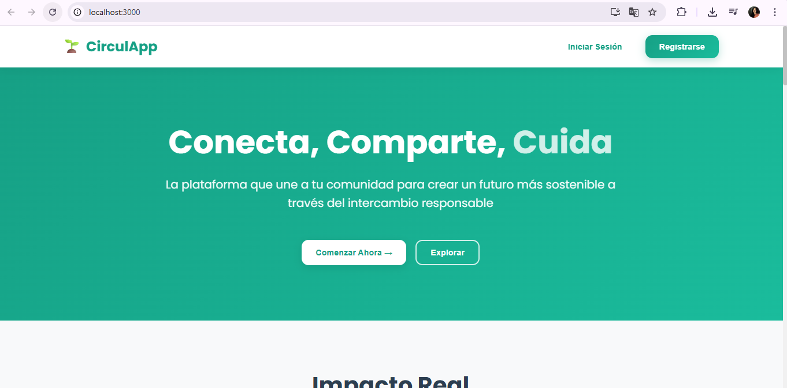
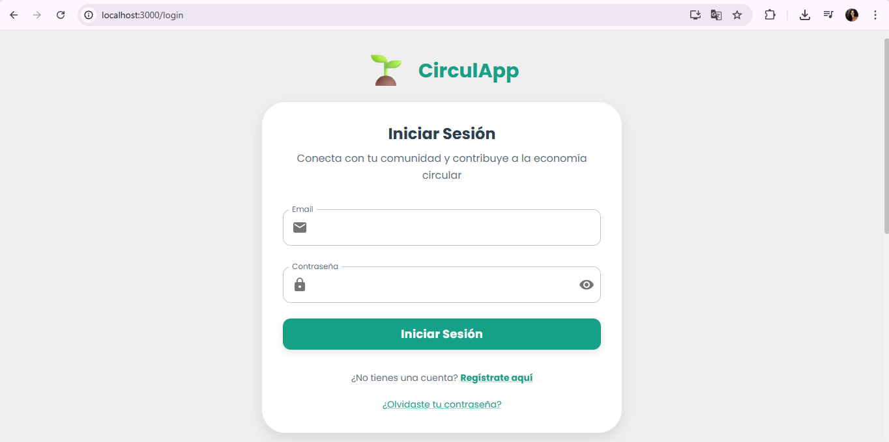
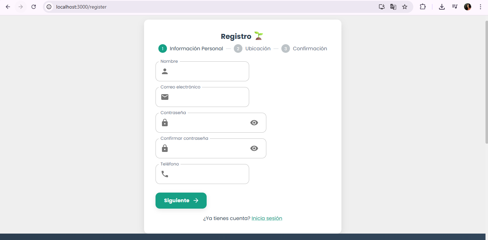

# 🌱 Circulapp

**Plataforma de Economía Colaborativa para Gestión Integral de Materiales**

[](LICENSE)
[]()
[]()

---

## 📖 Descripción

Circulapp es una plataforma web y móvil innovadora que facilita la economía circular y colaborativa en comunidades locales. Permite a los usuarios donar, intercambiar y gestionar productos de manera sostenible, con un enfoque especial en la gestión integral de materiales reciclables y la coordinación con organismos gubernamentales.

### ✨ Características principales

- 🔄 **Intercambio de productos** entre miembros de la comunidad
- 📅 **Agendas de recolección** coordinadas y optimizadas
- 👥 **Buscador especializado de usuarios** por competencias
- 📚 **Módulo educativo** con instrucciones de procesamiento de materiales
- 📊 **Sistema de contabilidad** y trazabilidad de materiales
- ✅ **Validación estandarizada** de materiales fardados
- 🗺️ **Visualizador de planos técnicos** de estaciones de procesamiento
- 💬 **Chat en tiempo real** con templates especializados
- ⭐ **Sistema de reputación** diferenciado por especialización

---

## 🎯 Objetivos del proyecto

- **Promover la economía circular** reduciendo residuos y fomentando la reutilización
- **Facilitar la coordinación** entre ciudadanos y organismos de gestión ambiental
- **Estandarizar procesos** de validación y procesamiento de materiales
- **Crear trazabilidad completa** desde la recolección hasta el procesamiento final
- **Educar a la comunidad** sobre mejores prácticas de reciclaje

---

## 👥 Tipos de usuarios

| Usuario | Descripción | Funcionalidades principales |
|---------|-------------|----------------------------|
| **🏠 Usuario Individual** | Ciudadanos que donan/buscan productos | Publicar productos, buscar materiales, coordinar intercambios |
| **♻️ Gestor de Materiales** | Especialistas en reciclaje y validación | Validar materiales, coordinar recolecciones, gestionar fardos |
| **🏭 Coordinador de Estación** | Supervisores de estaciones de procesamiento | Supervisar procesos, acceder a planos técnicos, generar reportes |
| **👨‍💼 Administrador** | Gestores del sistema y métricas | Panel completo, reportes ambientales, gestión de usuarios |

---

## 🚀 Tecnologías utilizadas

### Frontend
- **React.js** - Biblioteca de JavaScript para interfaces de usuario
- **React Native** - Desarrollo de aplicación móvil multiplataforma
- **Tailwind CSS** - Framework de CSS para diseño responsivo
- **JavaScript** - Lenguaje de programacion principal

### Backend
- **Node.js** - Entorno de ejecución de JavaScript
- **Express.js** - Framework web minimalista
- **JWT** - Autenticación segura basada en tokens
- **bcrypt** - Encriptación de contraseñas

### Base de datos
- **MongoDB** - Almacenamiento de documentos y logs

### Servicios externos
- **Google Maps API** - Geolocalización y mapas
- **Cloudinary** - Almacenamiento y gestión de imágenes

---

## 📋 Funcionalidades principales

### 🔐 Sistema de autenticación
- Registro con email y verificación
- Login con redes sociales 
- Autenticación institucional para roles especializados
- Gestión de permisos basada en roles (RBAC)

### 📦 Gestión de productos
- Publicación con imágenes y categorización avanzada
- Búsqueda y filtrado por múltiples criterios
- Geolocalización precisa de productos
- Estados de disponibilidad en tiempo real

### 📅 Coordinación de recolecciones
- Calendario integrado para agendar recolecciones
- Optimización automática de rutas
- Notificaciones y recordatorios
- Asignación de responsables

### ✅ Validación de materiales
- Checklist digital según metodología estandarizada
- Captura de evidencias fotográficas
- Integración con básculas y sensores
- Certificación automática

### 📊 Reportes y métricas
- Dashboard con métricas ambientales
- Trazabilidad completa de materiales
- Reportes personalizables por fecha/tipo
- Exportación en múltiples formatos

---

## 🛠️ Instalación y configuración

### Prerrequisitos
- **Node.js** (v18 o superior)
- **npm** o **yarn**

### Instalación

```bash
# Clonar el repositorio
git clone https://github.com/MayraMoy/CirculApp2.git
cd circulapp

# Instalar dependencias del backend
cd backend
npm install

# Instalar dependencias del frontend
cd ../frontend
npm install

### Configuración de variables de entorno

Crear archivo `.env` en la carpeta `backend/`:

```env
# Configuración del backend
PORT=3000
MONGO_URI=mongodb://localhost:27017/circulapp

# JWT
JWT_SECRET=tu_secreto

# APIs externas
GOOGLE_MAPS_API_KEY=tu_google_maps_key
CLOUDINARY_CLOUD_NAME=tu_cloudinary_name
CLOUDINARY_API_KEY=tu_cloudinary_key
CLOUDINARY_API_SECRET=tu_cloudinary_secret

# Comuna API
COMUNA_API_URL=https://api.comuna.local
COMUNA_API_KEY=tu_comuna_api_key
```

### Ejecutar la aplicación

```bash
# Backend 
cd backend
npm start

# Frontend 
cd frontend
npm start

```

---

## 📱 Capturas de pantalla

### Panel principal




---

## 📚 Documentación

### Documentos principales
- [📄 Especificación de Requisitos (SRS)](docs/ESPECIFICACIÓN%20DE%20REQUISITOS%20DE%20SOFTWARE%20(2).pdf)
- [🏗️ Arquitectura del Sistema]()
- [🔌 Documentación API]()
- [👨‍💻 Guía de Desarrollo]()
- [🚀 Guía de Despliegue]()

---

## 🤝 Contribución

¡Las contribuciones son bienvenidas! Por favor, lee nuestra [guía de contribución](CONTRIBUTING.md) antes de enviar pull requests.

### Proceso de desarrollo

1. **Fork** el repositorio
2. Crea una **rama feature** (`git checkout -b feature/nueva-funcionalidad`)
3. **Commit** tus cambios (`git commit -m 'Add: nueva funcionalidad'`)
4. **Push** a la rama (`git push origin feature/nueva-funcionalidad`)
5. Abre un **Pull Request**

### Convención de commits

```
feat: nueva funcionalidad
fix: corrección de bug
docs: documentación
style: formato, punto y coma faltante, etc.
refactor: refactorización de código
test: agregar tests
chore: actualizar tareas de build, configuración, etc.
```

---

## 📞 Soporte y contacto

### Equipo de desarrollo

- **👩‍💻 Mayra Moyano** - *Líder del proyecto* - [mayrayazminmo@email.com](mailto:mayrayazminmoyano@gmail.com)
- **👩‍💼 Marilen Cornejo** - *QA Tester* - [marilencornejo12@email.com](mailto:marilencornejo12@gmail.com)

### Reportar problemas

- 🐛 **Bugs**: [Abrir issue en GitHub](https://github.com/MayraMoy/CirculApp2/issues)
- 💡 **Sugerencias**: [Discusiones en GitHub](https://github.com/MayraMoy/CirculApp2/discussions)

---

## 📄 Licencia

Este proyecto está bajo la Licencia MIT. Ver el archivo [LICENSE](LICENSE) para más detalles.

---

## 🙏 Agradecimientos

- **Comuna** - Por la colaboración y especificaciones técnicas
- **Comunidad Open Source** - Por las herramientas y librerías utilizadas

---

## 🌍 Impacto ambiental

**Objetivo:** Reducir en un 30% los residuos enviados a vertederos a través de la reutilización y reciclaje coordinado.

**Métricas esperadas:**
- ♻️ **1000+ kg** de materiales procesados mensualmente
- 🏠 **500+** familias participando activamente
- 📈 **70%** de eficiencia en rutas de recolección
- 🌱 **25%** de reducción en costos de gestión de residuos

---

**¡Gracias por tu interés en Circulapp! Juntos construimos un futuro más sostenible.** 🌱✨